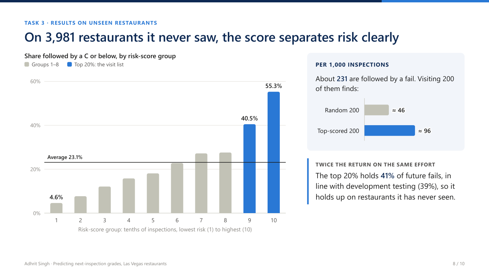
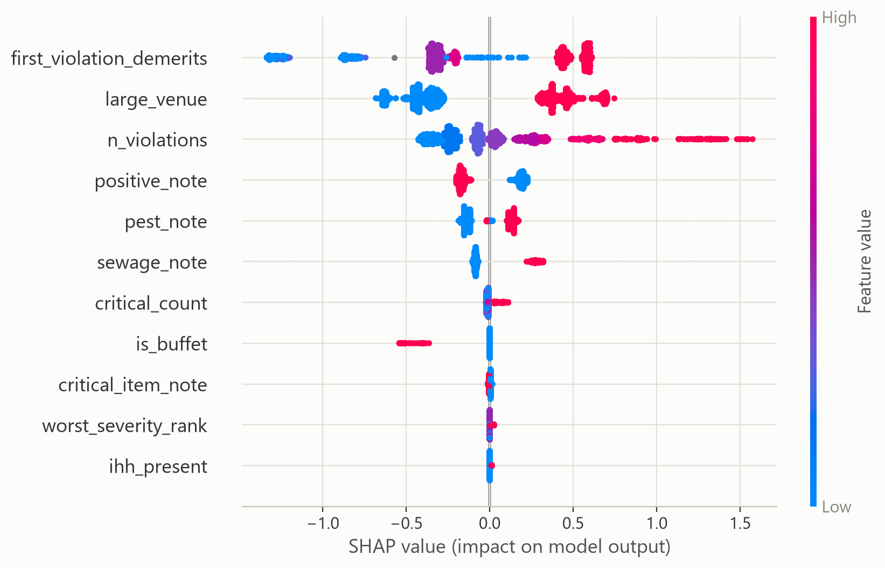

# Predicting which restaurants will fail their next inspection

[](https://github.com/AdhritSingh21/restaurant-inspection-risk-model/actions/workflows/ci.yml)
[](LICENSE)

An end-to-end machine-learning project on Las Vegas restaurant inspection data. It cleans a deliberately messy dataset, explores it, engineers features (including from inspectors' free-text comments), and builds a model that predicts whether a restaurant's **next** inspection will be graded **C or below**.

**Read the results:** [10-slide summary (PDF)](presentation.pdf) · [Full report (HTML)](report.html). The report is a self-contained file: download it and open it in any browser.



## Results at a glance

Measured on a holdout of 3,981 restaurants (6,964 inspections) that played no part in building or choosing the model:

| Metric | Holdout | For reference |
|---|---:|---|
| ROC-AUC | **0.729** | 0.5 = random |
| Average Precision | **0.453** | 0.231 = no skill (the base rate) |
| Future C's caught in the riskiest 20% | **41.4%** | 20% = random visits |
| Precision at the fixed threshold (flags 20.7%) | **47.0%** | 23.1% = base rate |

In plain terms, visiting the 20% of restaurants with the highest scores finds about **twice** as many future failures as visiting at random. The score is good enough to prioritize inspection or loss-control visits, but not to call the outcome for any single restaurant.

## Approach

| Notebook | What it does |
|---|---|
| [`01_data_cleaning.ipynb`](01_data_cleaning.ipynb) | 85 logged cleaning steps across 42 columns, with no rows dropped. It handles placeholder tokens, spelling variants, impossible values and longitudes stored without their minus sign. Violation lists are parsed into codes and comments are split into fragments. 21 automated readiness checks. |
| [`02_eda.ipynb`](02_eda.ipynb) | Splits off a restaurant-grouped 80/20 holdout *before* any analysis. Exploratory analysis then uses training rows only, with restaurant-clustered intervals. 10 checks. |
| [`03_features.ipynb`](03_features.ipynb) | Registers 49 candidate features in 8 groups. Inspector shorthand is expanded, and 307 comment templates are mapped to food-safety regulation topics (TF-IDF plus hand review). Forward selection and drop-one tests with grouped CV narrow these to 11 features. 12 checks. |
| [`04_modeling.ipynb`](04_modeling.ipynb) | Compares baselines, logistic regression, random forest and gradient boosting, tuned with 5-fold restaurant-grouped CV. Sets a capacity-based threshold, then checks calibration and SHAP drivers. The holdout is evaluated once, at the end. 18 checks, 10 of them for leakage. |

Design choices worth noting:

- **Leakage control.** The holdout is grouped by restaurant and was scored only once, after the model, features and threshold were fixed. All preprocessing is fitted inside the CV pipelines. Fields whose timing is uncertain (the restaurant's *current* grade and demerits) were tested and excluded.
- **A metric that matches the use.** The score feeds a capacity-limited visit list, so Average Precision and top-20% capture are the primary metrics, with ROC-AUC as the benchmark.
- **Tested row-local cleaning.** [`tests/test_row_independence.py`](tests/test_row_independence.py) shows that changing or adding one inspection never changes another row's cleaned values.

## Key findings

- **What the latest inspection found is the strongest signal.** The share followed by a C or below climbs from 15% at 3 violations to 71% at 15 or more.
- **Large venues are riskier.** Restaurants with more than 200 seats sit at 30.6% versus 17.6%, and they are 12 to 15 points higher at every violation count.
- **Inspector notes add information beyond the violation codes.** Notes about pests or sewage go with higher risk, while praise goes with lower risk.
- **Several fields added nothing.** Complaints, illness counts, review ratings, location, staffing, opening hours and the restaurant's earlier inspections showed no meaningful added value.
- **Final model: gradient boosting** (100 shallow trees on 11 features). It beat tuned logistic regression in all 5 CV folds by a small margin, and logistic regression remains a transparent fallback.



## Data

`raw/` holds the inputs:

- `DATASET_2026.csv` contains 35,000 inspections of 19,902 restaurants, April 2020 to September 2026. It is a modified version of Las Vegas restaurant inspection data (original source: the City of Las Vegas Open Data Portal), with added business columns and deliberately introduced data-quality problems. Some patterns suggest that parts are synthetic (see the report's limitations), so the findings may not carry over to real inspection data.
- `Restaurant_Inspection_Violation_Codes.csv` is the violation code lookup (code, demerits, description).
- `inspector_acronym_lookup.csv` holds 48 inspector shorthand expansions.
- `regulations_corpus.jsonl` holds short food-safety regulation references (paraphrased FDA Food Code sections and violation-code descriptions). It is not legal text.

## Reproducing

Requires Python 3.11. The package versions are pinned in `requirements.txt`.

```bash
python -m venv .venv
.venv\Scripts\activate          # macOS/Linux: source .venv/bin/activate
pip install -r requirements.txt
```

Run the notebooks in order (01 → 02 → 03 → 04) from the repository root. Each one reads the previous one's outputs (`clean/`, `features/`, `models/`) and writes figures to `figures/`. Fixed seeds make reruns identical. To run them from the command line:

```bash
jupyter nbconvert --to notebook --execute --inplace 01_data_cleaning.ipynb
```

Then run the same command for the other three notebooks, in order. The cleaning test is described in [`tests/README.md`](tests/README.md).

On every push, CI reruns all four notebooks from the raw data on a clean Linux machine, runs the cleaning test, and checks that the holdout ROC-AUC, Average Precision and top-20% capture still match the table above (see the badge at the top).

## Repository layout

```
├── 01_data_cleaning.ipynb … 04_modeling.ipynb   analysis notebooks, with outputs
├── report.html                                   full write-up (self-contained HTML)
├── presentation.pdf                              10-slide non-technical summary
├── raw/                                          input data and lookups
├── figures/                                      charts saved by the notebooks
├── tests/                                        row-independence test for the cleaning step
├── .github/workflows/ci.yml                      CI: rerun the pipeline and check the results
├── LICENSE                                       MIT (covers the code)
└── requirements.txt
```

## License

The code (notebooks and tests) is released under the [MIT License](LICENSE). The data in `raw/` is not covered by this license: it is a modified version of public City of Las Vegas inspection data, included so the analysis can be reproduced.

---

*Adhrit Singh, October 2026*
